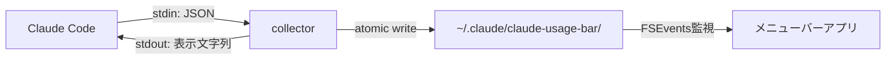

# claude-code-usage-bar

Claude Codeの使用率をmacOSメニューバーに常時表示するネイティブアプリ。`statusLine` hookからローカルJSONを取得し、ネットワーク通信なしで動作する。

---

## 特徴

- **メニューバー常駐**: `CC 5h 42% / 7d 18%` のように5時間枠・7日枠の使用率を一目で確認
- **ネットワーク通信不要**: Claude Codeの`statusLine` hookが提供するローカルJSONのみで動作
- **既存設定との共存**: 既にある`statusLine`設定を壊さないラッパー方式
- **閾値通知**: 使用率70%/85%/95%超過時にmacOS通知
- **軽量**: Swift/SwiftUIネイティブ、メモリ20MB以下
- **Pro/Max対応**: `rate_limits`が提供されるPro/Maxプラン向け

---

## スクリーンショット

> （開発中 — スクリーンショットは初回リリース時に追加予定）

---

## アーキテクチャ概要

### データフロー



1. **Claude Code** が`statusLine` hookとしてcollectorを起動
2. **collector** がJSONを解析し、セッションスナップショットをファイルに保存
3. **メニューバーアプリ** がFSEventsでファイル変更を検知し、使用率を更新表示

詳細は[アーキテクチャ](docs/architecture.md)を参照。

---

## インストール

### Homebrew Cask

```bash
brew install --cask claude-code-usage-bar
```

### 手動インストール

1. [Releases](https://github.com/yourname/claude-code-usage-bar/releases)からDMGをダウンロード
2. アプリを`/Applications`にドラッグ
3. 初回起動時にcollectorのセットアップを案内

---

## 使い方

### 初期設定

1. アプリを起動するとセットアップウィザードが表示される
2. 「collectorをインストール」をクリック — `~/.claude/settings.json`にcollectorが登録される
3. Claude Codeでセッションを開始すると、メニューバーに使用率が表示される

既存の`statusLine`設定がある場合は自動的にラッパー方式で共存する。元の設定はバックアップされ、いつでも復元可能。

### メニューバー表示の読み方

| 表示 | 意味 |
|------|------|
| `CC 5h 42% / 7d 18%` | 5時間枠42%使用、7日枠18%使用 |
| `CC —` | データ未受信（セッション未開始 or 非対応プラン） |
| オレンジ色テキスト | 使用率70%超（注意） |
| 赤色テキスト | 使用率85%超（警告） |

メニューバーをクリックするとポップオーバーで詳細情報（ゲージ、リセット時刻、コンテキスト使用率、セッション一覧）を確認できる。

---

## 開発

### 必要環境

| 項目 | バージョン |
|------|-----------|
| macOS | 13.0 Ventura以上（MenuBarExtra要件）、14.0 Sonoma推奨 |
| Xcode | 15.0以上 |
| Swift | 5.9以上 |

### ビルド手順

```bash
git clone https://github.com/yourname/claude-code-usage-bar.git
cd claude-code-usage-bar

# Swift Package Managerでビルド・実行
swift build
swift run
```

---

## ドキュメント

### 目次

| ドキュメント | 内容 |
|------------|------|
| [概要・前提](docs/overview.md) | `statusLine` hook仕様、JSON構造、Claude Code概説 |
| [アーキテクチャ](docs/architecture.md) | データフロー図、コンポーネント責務、プロセス間通信 |
| [collector設計](docs/collector.md) | `statusLine`ラッパー方式、settings.json安全操作 |
| [メニューバーアプリ設計](docs/menubar-app.md) | Swift/SwiftUI/MenuBarExtra実装、ファイル監視、状態管理 |
| [データスキーマ](docs/data-schema.md) | セッションJSON定義、履歴データ形式 |
| [UX設計](docs/ux-design.md) | 表示文字列、ポップオーバー、エラー状態、通知 |
| [技術選定](docs/tech-decisions.md) | 採用/不採用の比較（Electron, Tauri, SwiftBar等） |
| [MVPスコープ](docs/mvp-scope.md) | v1.0機能セット、v1.1/v2.0ロードマップ |
| [配布・運用](docs/distribution.md) | 署名、notarization、Sparkle、Homebrew Cask |
| [ベストプラクティス](docs/best-practices.md) | settings.json安全操作、collector性能、テスト戦略 |
| [将来拡張](docs/future.md) | OpenTelemetry、履歴分析、ウィジェット対応 |
| [設計書](docs/DESIGN.md) | ドキュメント構成・命名規則・執筆ガイドライン（内部向け） |

---

## ライセンス

MIT License
