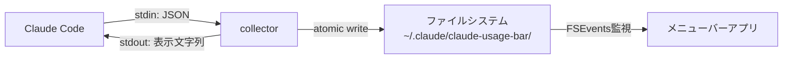
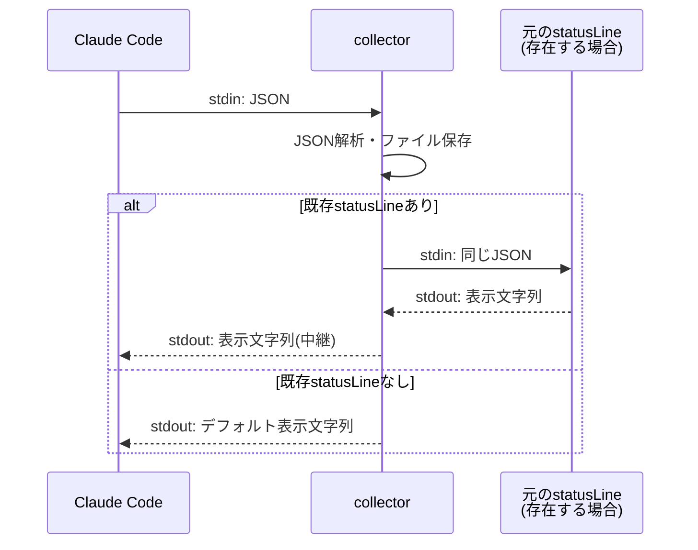

# アーキテクチャ

claude-code-usage-barの全体アーキテクチャ、コンポーネント責務、プロセス間通信を定義する。

---

## 全体アーキテクチャ

### データフロー図



1. **Claude Code** が `statusLine` hookとしてcollectorを起動し、セッション情報をstdin JSONで渡す
2. **collector** がJSONを解析し、ファイルシステムにセッションスナップショットを保存する
3. **collector** は元の`statusLine`出力（ある場合）をstdoutに返す
4. **メニューバーアプリ** がFSEventsでファイル変更を検知し、使用率を更新表示する

### コンポーネント一覧

| コンポーネント | 役割 | 実装技術 |
|--------------|------|---------|
| Claude Code | データソース（`statusLine` JSON提供） | Anthropic提供 |
| collector | データ収集・永続化 | Swift CLI |
| メニューバーアプリ | 使用率の表示・通知 | Swift / SwiftUI / MenuBarExtra |
| ファイルシステム | コンポーネント間のデータ受け渡し | JSON ファイル |

---

## コンポーネント責務

### Claude Code（データソース）

- `statusLine` hookの発火元
- セッション情報（model、cost、context_window、rate_limits）をJSON形式でcollectorに提供
- collectorのstdout出力をIDEステータスバーに反映
- **本アプリが制御する範囲外** — Claude Codeの動作は変更しない

### collector（データ収集・永続化）

- `statusLine`コマンドとして`~/.claude/settings.json`に登録される
- stdinからJSON受信 → 解析 → ファイルに永続化
- 既存の`statusLine`設定がある場合はラッパーとして動作し、元のコマンドを実行して出力を中継
- **性能要件**: 実行時間50ms以下、ネットワーク通信禁止、atomic writeによるデータ整合性保証

詳細: [collector設計](collector.md)

### メニューバーアプリ（表示・通知）

- macOSメニューバーに使用率を常時表示（例: `CC 5h 42% / 7d 18%`）
- ファイル変更をFSEventsで検知しリアルタイム更新
- 使用率の閾値超過時にUserNotificationsで通知（70%/85%/95%）
- ポップオーバーで詳細情報（ゲージ、リセットカウントダウン、セッション一覧）を表示
- Launch at Login対応（SMAppService）

詳細: [メニューバーアプリ設計](menubar-app.md)

---

## プロセス間通信

### stdin/stdout（Claude Code ↔ collector）



- Claude Codeが`statusLine`コマンドを実行するたびに発生
- collectorの起動・実行・終了は1回のhook呼び出しで完結（常駐プロセスではない）

### ファイルシステム（collector ↔ アプリ）

collectorとメニューバーアプリはプロセスとして直接通信せず、ファイルシステムを介してデータを受け渡す。

| 項目 | 仕様 |
|------|------|
| データディレクトリ | `~/.claude/claude-usage-bar/` |
| ファイル形式 | セッション単位のJSONファイル |
| 書き込み方式 | atomic write（一時ファイル → rename） |
| 命名規約 | `{session_id}.json` |

### FSEvents / DispatchSource（ファイル変更監視）

メニューバーアプリは`~/.claude/claude-usage-bar/`ディレクトリをFSEvents（またはDispatchSource）で監視する。

| 項目 | 仕様 |
|------|------|
| 監視方式 | FSEvents（推奨）またはDispatchSource.makeFileSystemObjectSource |
| 監視対象 | `~/.claude/claude-usage-bar/` ディレクトリ |
| フォールバック | ポーリング（30秒間隔） |
| 更新トリガー | ファイルの作成・変更を検知 |

---

## セキュリティモデル

### ネットワーク通信なし

claude-code-usage-barは**一切のネットワーク通信を行わない**。すべてのデータはローカルファイルシステム上のJSON読み書きのみで完結する。Claude.aiやAnthropic APIへの接続は行わない。

### 認証情報の非保持

本アプリはAPIキー、セッショントークン、パスワード等の認証情報を一切保持・参照しない。`statusLine`から受け取るJSONには認証情報は含まれない。

### サンドボックス設計

| 項目 | 設計 |
|------|------|
| ファイルアクセス | `~/.claude/`以下のみ読み書き |
| ネットワーク | 不使用（App Sandboxで制限可能） |
| Keychain | 不使用 |
| 外部プロセス起動 | collectorのみ（`statusLine`経由で起動） |

---

## 複数セッション対応

### session_idによる分離

Claude Codeは複数のセッションを同時に実行できる。各セッションは固有の`session_id`を持ち、collectorはセッションごとに個別のJSONファイルを作成する。

```
~/.claude/claude-usage-bar/
└── sessions/
    ├── session_abc123.json    # セッション1のスナップショット
    ├── session_def456.json    # セッション2のスナップショット
    └── session_ghi789.json    # セッション3のスナップショット
```

### 最新データの選択ロジック

メニューバーアプリは複数セッションのデータを以下のロジックで集約する:

1. `~/.claude/claude-usage-bar/`内の全JSONファイルを読み込む
2. 各ファイルの更新タイムスタンプ（`updated_at`）を比較
3. `rate_limits`は**最も新しいタイムスタンプを持つセッション**の値を採用（rate_limitsはアカウント全体の値であり、セッション固有ではないため）
4. `context_window`と`cost`はセッション別に表示（ポップオーバーのセッション一覧）
5. 一定時間（例: 30分）更新のないセッションは「非アクティブ」として扱う

---

## 関連リンク

- [statusLine仕様](overview.md)
- [collectorコンポーネントの詳細](collector.md)
- [メニューバーアプリの詳細](menubar-app.md)
- [データスキーマの詳細](data-schema.md)
