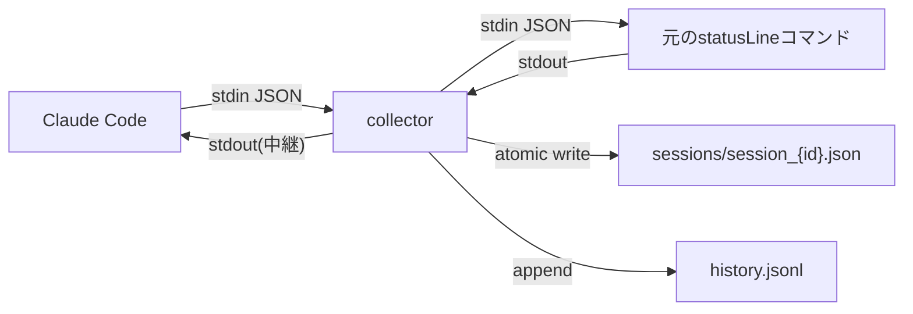
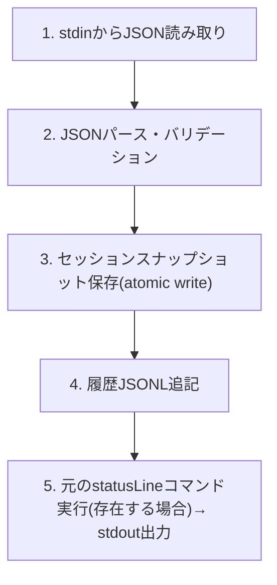

# collector設計

`statusLine` hookをラップしてセッションデータを収集・永続化するcollectorコンポーネントの設計を定義する。

---

## 概要

collectorはClaude Codeの`statusLine`コマンドとして登録されるCLIプログラムである。`statusLine` hookが発火するたびに起動され、stdinからJSONを受け取り、ファイルに保存し、stdoutに表示文字列を返して終了する。常駐プロセスではない。

---

## collectorの役割

1. stdinからstatusLine JSONを読み取る
2. JSONを解析し、セッションスナップショットとしてファイルに保存する
3. 履歴データ（JSONL）に追記する
4. 既存の`statusLine`コマンドがある場合は、そのコマンドにJSONを渡して実行し、出力を中継する
5. stdoutに表示文字列を返す

---

## ラッパー方式の設計

### 既存statusLine設定との共存

ユーザーが既に`statusLine`を設定している場合（例: 他のツールや独自スクリプト）、collectorはその設定を破壊せず、ラッパーとして動作する。



### 処理フロー（5ステップ）



| ステップ | 処理内容 | エラー時の動作 |
|---------|---------|--------------|
| 1 | stdinからJSONを全文読み取り | 空の場合はstdout空文字で終了 |
| 2 | JSON解析、必須フィールド確認 | パース失敗時はJSONを元コマンドに中継して終了 |
| 3 | `sessions/session_{session_id}.json`にatomic write | 書き込み失敗時はログに記録し続行 |
| 4 | `history.jsonl`に1行追記 | 追記失敗時はログに記録し続行 |
| 5 | 元コマンド実行 or デフォルト文字列出力 | 元コマンド失敗時はデフォルト文字列を出力 |

---

## settings.jsonの操作

### 差分方式（丸ごと上書き禁止）

`~/.claude/settings.json`への変更は差分方式で行う。ファイル全体を上書きすると他の設定を破壊するリスクがある。

```swift
// 正しい: 差分更新
let settings = try JSONSerialization.jsonObject(with: data) as? [String: Any] ?? [:]
var updated = settings
updated["statusLine"] = collectorConfig
try JSONSerialization.data(withJSONObject: updated).write(to: settingsURL)
```

### バックアップと復元

インストール時に既存の`settings.json`をバックアップする:

```
~/.claude/claude-usage-bar/backup/settings.json.bak
```

| 操作 | 処理 |
|------|------|
| 初回インストール | 現在の`settings.json`を`backup/`にコピー（バックアップが存在しない場合のみ） |
| アンインストール | `backup/`から復元（ユーザー確認後） |
| 更新 | バックアップは上書きしない（元の設定を保持） |

バックアップは初回インストール時のみ作成する。既にバックアップファイルが存在する場合は上書きしない。これにより、アプリの更新や再インストール時に元の`settings.json`（collectorインストール前の状態）が失われることを防ぐ。

```swift
let backupURL = usageBarDir.appendingPathComponent("backup/settings.json.bak")
if !FileManager.default.fileExists(atPath: backupURL.path) {
    try FileManager.default.copyItem(at: settingsURL, to: backupURL)
}
```

### 既存statusLineの検出と保持

インストール時に既存の`statusLine`設定を検出し、collector設定内に保存する:

```json
{
  "statusLine": {
    "command": "/path/to/collector",
    "refreshInterval": 10000,
    "__claude_usage_bar_original": {
      "command": "/original/statusline/command",
      "refreshInterval": 5000
    }
  }
}
```

collectorは`__claude_usage_bar_original`の`command`を子プロセスとして実行し、その出力を中継する。

---

## 保存形式

### ディレクトリ構造（~/.claude/claude-usage-bar/）

```
~/.claude/claude-usage-bar/
├── sessions/                   # セッションスナップショット
│   ├── session_abc123.json
│   └── session_def456.json
├── history.jsonl               # 時系列履歴（append-only）
├── backup/                     # settings.jsonバックアップ
│   └── settings.json.bak
└── collector.log               # エラーログ（デバッグ用、サイズ上限あり）
```

### セッション単位JSON

各セッションのスナップショットは独立したJSONファイルとして保存される。ファイル名は`session_{session_id}.json`。

スキーマの詳細: [データスキーマ](data-schema.md)

### atomic write（途中状態の防止）

ファイル書き込みは必ずatomic writeで行う:

1. 一時ファイル（`session_{session_id}.json.tmp`）に書き込み
2. `rename(2)`で本来のパスに移動

これにより、メニューバーアプリが中途半端なJSONを読み込む事態を防止する。

```swift
let tmpURL = sessionsDir.appendingPathComponent("session_\(sessionId).json.tmp")
let finalURL = sessionsDir.appendingPathComponent("session_\(sessionId).json")
try data.write(to: tmpURL, options: .atomic)
try FileManager.default.replaceItemAt(finalURL, withItemAt: tmpURL)
```

`replaceItemAt(_:withItemAt:)`を使用する理由: `moveItem`は移動先にファイルが既に存在する場合に失敗する。`replaceItemAt`は既存ファイルを安全に置換し、2回目以降の書き込みでもエラーにならない。

---

## 性能要件

### ネットワーク通信禁止

collectorは一切のネットワーク通信を行わない。DNS解決、HTTP(S)リクエスト、ソケット接続のすべてが禁止。

### 実行時間の上限

| 指標 | 目標値 |
|------|--------|
| 全体実行時間 | < 50ms |
| JSON解析 | < 5ms |
| ファイル書き込み | < 20ms |
| 元コマンド実行（ある場合） | < 25ms（タイムアウト設定） |

`statusLine`は高頻度で実行されるため（デフォルト10秒間隔）、collectorが遅いとClaude Codeのレスポンスに影響する可能性がある。

### npx/重いプロセス起動の回避

- Node.js (`npx`, `node`)の起動は禁止（起動コストが100ms超）
- Python (`python3`)の起動は禁止（同上）
- 許容: コンパイル済みバイナリ（Swift CLI）、シェルスクリプト（軽量な場合のみ）

---

## インストール・アンインストール

### collectorバイナリの配置

| 方式 | パス |
|------|------|
| アプリバンドル内 | `ClaudeUsageBar.app/Contents/MacOS/collector` |
| シンボリックリンク | `/usr/local/bin/claude-usage-bar-collector` → アプリ内 |

メニューバーアプリが初回起動時にcollectorのセットアップを行う。

### settings.jsonへの登録

メニューバーアプリの初期設定フローで以下を行う:

1. `~/.claude/settings.json`の読み込み
2. 既存`statusLine`設定の検出・バックアップ
3. collectorコマンドの登録

登録後の`settings.json`:

```json
{
  "statusLine": {
    "command": "/Applications/ClaudeUsageBar.app/Contents/Resources/collector",
    "refreshInterval": 10000,
    "__claude_usage_bar_original": null
  }
}
```

### クリーンなアンインストール

アンインストール時に以下を復元・削除する:

| 対象 | アクション |
|------|----------|
| `~/.claude/settings.json` | `statusLine`をバックアップから復元（または削除） |
| `~/.claude/claude-usage-bar/` | ユーザー確認後に削除（履歴データを含むため） |
| `/usr/local/bin/claude-usage-bar-collector` | シンボリックリンク削除 |

復元フロー:

1. `__claude_usage_bar_original`が存在 → その内容で`statusLine`を上書き
2. `__claude_usage_bar_original`が`null` → `statusLine`キー自体を削除
3. バックアップからの復元も選択可能

---

## 関連リンク

- [全体アーキテクチャ](architecture.md)
- [保存フォーマットの詳細](data-schema.md)
- [settings.json操作の安全性](best-practices.md)
- [statusLine仕様](overview.md)
